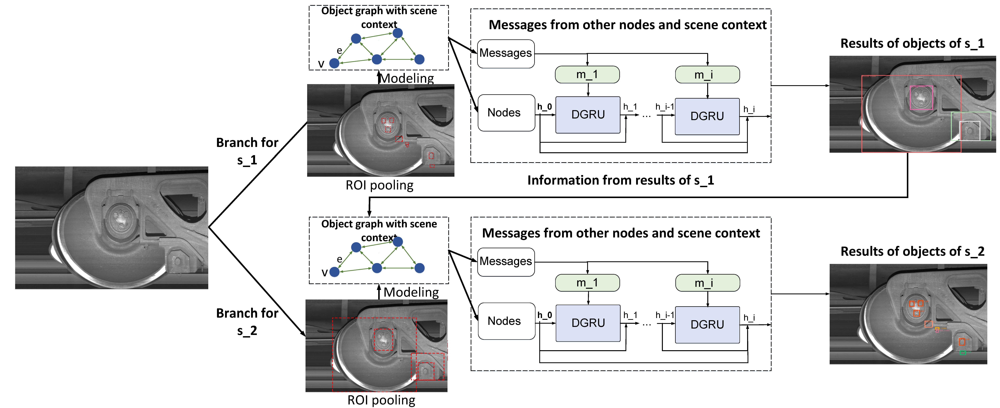

# HSGR

## Framework

Pretrained Model (to do)

Dataset (to do)

## Experiment Result 

### Comparison Sample

More samples are saved in folder ./sample

Comparison of FRCNNF (on the left) and HGRF-HSG (on the right)
 
 

Comparison of FRCNNF (on the left) and HGRF-ORG (on the right)
 
 

Comparison of FRCNNF (on the left) and HGRF (on the right)
 
 
